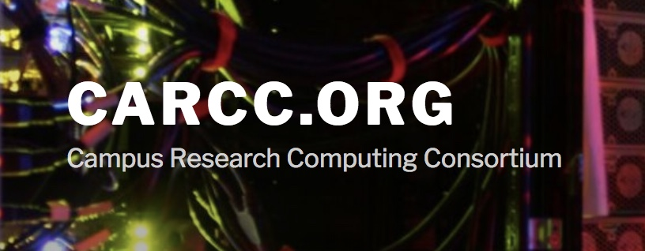

Title: Affiliates
Date: 2018-08-08

One of the objectives of the CyberAmbassador project is to reach out and work with other CI professional Organizations and connect them with Professional Skills training programs. The following is a list of affiliated organizations and training programs:

---

| |
|-|
[{ width=20%, align=right}](//www.xsede.org/community-engagement/campus-champions)  The Campus Champions Program is a group of 400+ Campus Champions at 200+ US colleges, universities, and other research-focused institutions, whose role is to help researchers at their institutions to use research computing, especially (but not exclusively) large scale and high end computing. |
|   |
| [{ width=20%, align=right}](//www.tbp.org/)   Co-Pi, Dr. Kathleen Colbry is the Director of the Tau Beta Pi Engineering Futures Program.  This program has trained volunteer facilitators that provide professional skills training to hundreds of Engineers and Engineering Students every year. |
|   |
| [{ width=20%, align=right}](//nrmnet.net/) Co-Pis, Drs. Dirk and Kathleen Colbry are facilitators for the NRMN which is a nationwide consortium institutions collaborating to provide mentor training with evidence-based mentorship and professional development programming. |
|   |
| [{ width=20%, align=right}](//carpentries.org/)  The Carpentries project comprises communities of Instructors, Trainers, Maintainers, helpers, and supporters who share a mission to teach foundational computational and data science skills to researchers. |  
|   |
| [{ width=20%, align=right}](//www.xsede.org/)  XSEDE is a single virtual system that scientists can use to interactively share computing resources, data and expertise. People around the world use these resources and services — things like supercomputers, collections of data and new tools — to improve our planet. |
|   |
| [{ width=20%, align=right}](//aciref.org/)  Advanced Cyberinfrastructure (ACI) Research and Education Facilitators (ACI-REFs).
|
|   |
| [{ width=20%, align=right}](//carcc.org/)  Advancing Research and Education through a national network of campus research computing infrastructures – The CaRC Consortium. 
|
